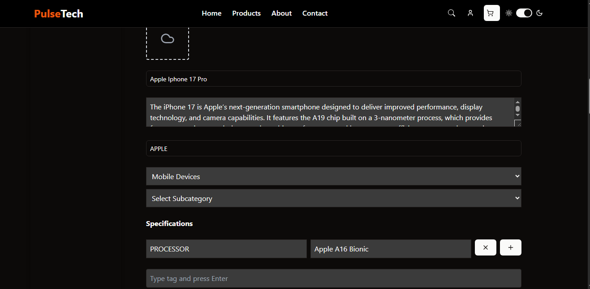
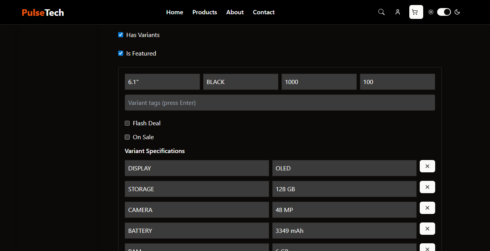
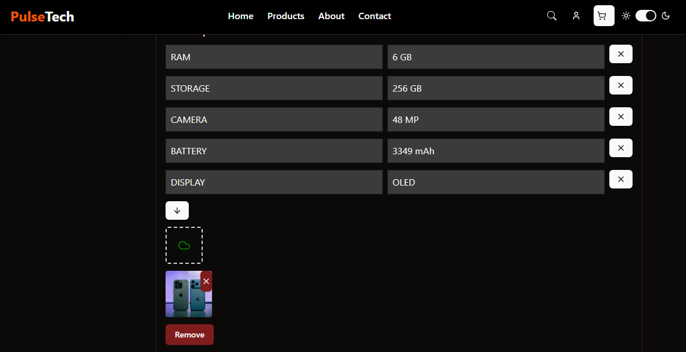
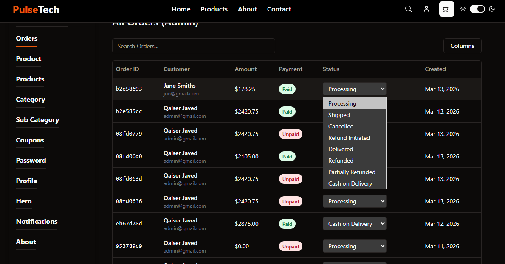
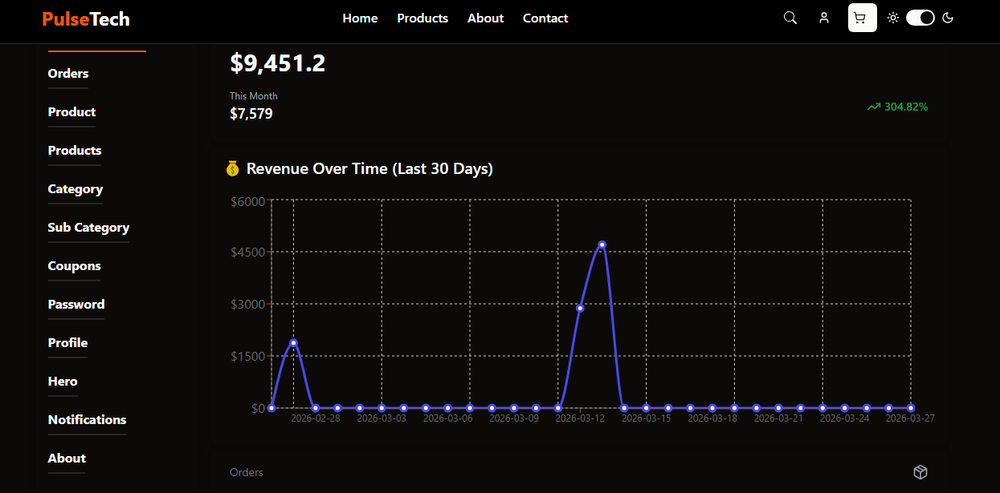
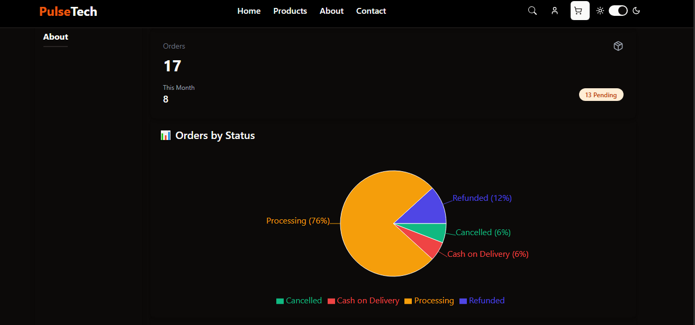
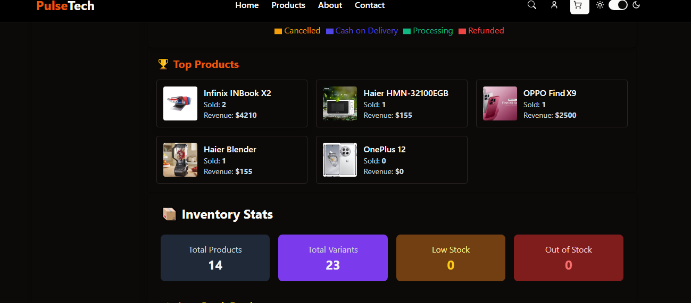
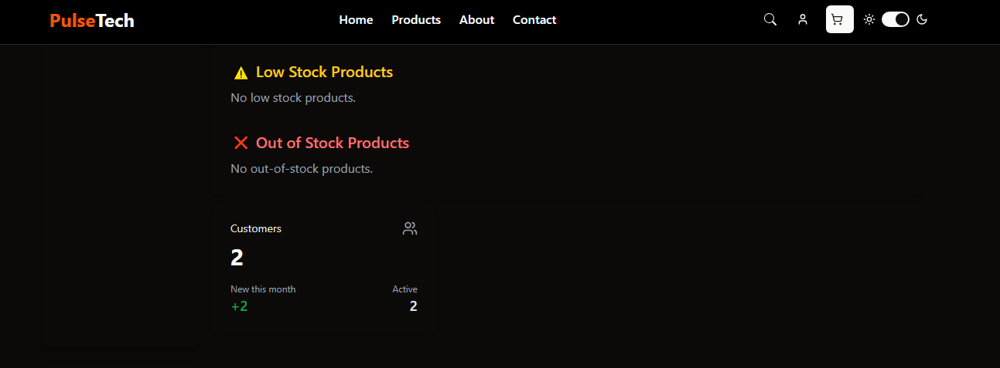

# 🛒 Scalable Full-Stack E-Commerce Platform with Stripe & Admin Dashboard

A scalable eCommerce application simulating a real-world shopping system with authentication, payments, and admin analytics.

[](https://eshop-frontend-69ze.vercel.app)

## 🔐 Demo Access

Admin:
email: admin@gmail.com  
password: pass1234 

User:
email: jon@gmail.com  
password: pass1234  

---
---

## 🎯 Why This Project Matters

> This project highlights my ability to build a **production-ready full-stack system**, not just UI components.

### 🚧 Key Challenges Solved

- ⚡ Efficient global state management using **Redux + React Query**
- 💳 Handling **asynchronous Stripe payment flows** with webhooks (including refunds & partial refunds)
- 🔗 Designing **scalable frontend ↔ backend communication**
- 🧩 Maintaining **clean architecture and separation of concerns**

---
## 🚀 Features

- JWT Authentication (Login / Register) Cookie Based
- Products and Product Variants browsing, search, filter & pagination
- Add to cart & checkout
- Stripe payment integration Refunds and Partial Refunds with Stripe Webook
- Order history tracking
- Admin dashboard integration with CMS features and Stats/Charts

---

## 🛠 Tech Stack

- React (Vite)
- Tailwind CSS / Shadcn
- Tanstack/React Query and Axios
- Redux / Redux Persist

---

## 📸 Screenshots

Admin Views







---

## 🧠 Key Highlights

- JWT for stateless authentication and secure role-based access  
- React Query for efficient API caching and state management  
- Tailwind CSS for responsive, mobile-friendly UI  
- Clean and modular code structure (frontend & backend separation)  
- Complete order lifecycle handling with admin analytics  

---

## 👨‍💻 About Project

This is a production-style full-stack eCommerce platform built with React, Next.js, Node.js, Express, and MongoDB. 
It simulates a real-world shopping experience including authentication, product browsing, cart management, checkout with Stripe payments, and a comprehensive admin dashboard.  

Key technical decisions include JWT for secure authentication, React Query for optimized API data handling, and Tailwind CSS for fast, responsive design.  

---

## 🔗 Backend Repository
https://github.com/qaiserjavaid00-cyber/eshop-backend

---

## ⚙️ Setup Instructions

```bash
git clone https://github.com/qaiserjavaid00-cyber/eshop-frontend
cd eshop-frontend
npm install
npm run dev
